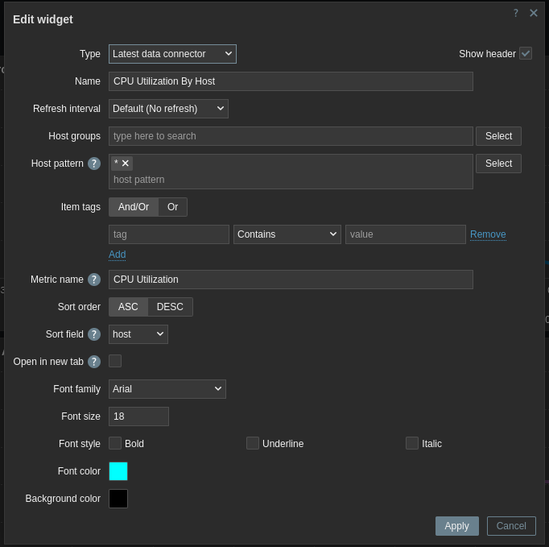

# Zabbix Custom Widget - Latest data connector

## Widget Form

## Widget View

## Required Zabbix version

 - Zabbix 7.0 (main branch)
 - Zabbix 6.4 (coming soon...)

## Purpose

- Zabbix global dashboards and the Latest data page are the most common places to go to view a large number of metrics on high-performance computing systems or systems that operate as clusters. Template dashboards are simply too cumbersome for such environments where there are hundreds or even thousands of hosts. This widget was developed with the idea that, in a global dashboard you should have simple graphs to display a few lines to show aggregated cluster metrics, or perhaps averages, max and min. Then, have a button (this widget) that enables one-click navigation to the Latest data page to show the individual per-host or per-process/application metrics for which there might be hundreds or thousands that comprise the aggregate graph. 

## Future Development

 - Expand the Latest page (create a UI module) that adds a way to display average, max, min and sum of values for a selected time period

## Functionality

 - Configure pre-set filters for Host groups, Hosts (patterns), Name, and Item tags
 - Pre-set filters will be used to construct a URL that will take you to the Latest data page with the filters applied
 - Permits a variety of color choices and fonts to create contrast and "pop" on the dashboard
 - Works with both global and template dashboards

## Installation Instructions

 - Clone this repo into the `ui/modules/` folder (standard path is `/usr/share/zabbix/modules/` from RPM installations)
 - Go to Zabbix URL -> Administration -> General -> Modules
 - Select `Scan directory` from the top right of the page
 - Find the `Latest data connector` widget and enable it on the right
